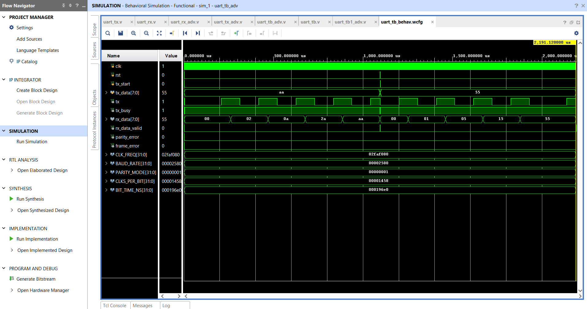
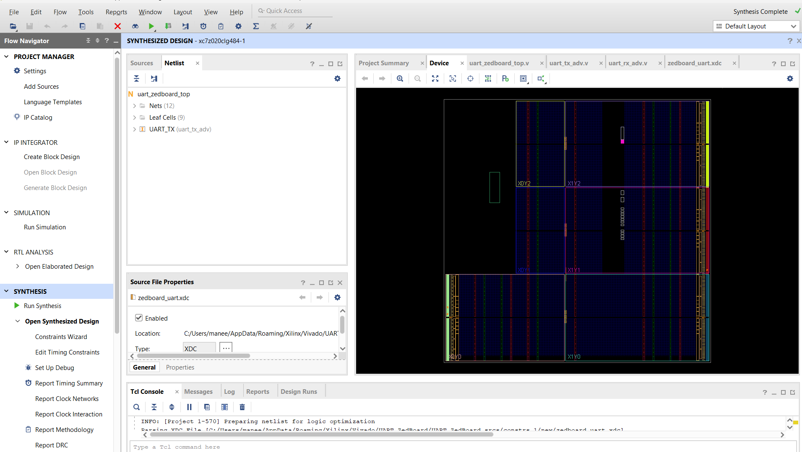
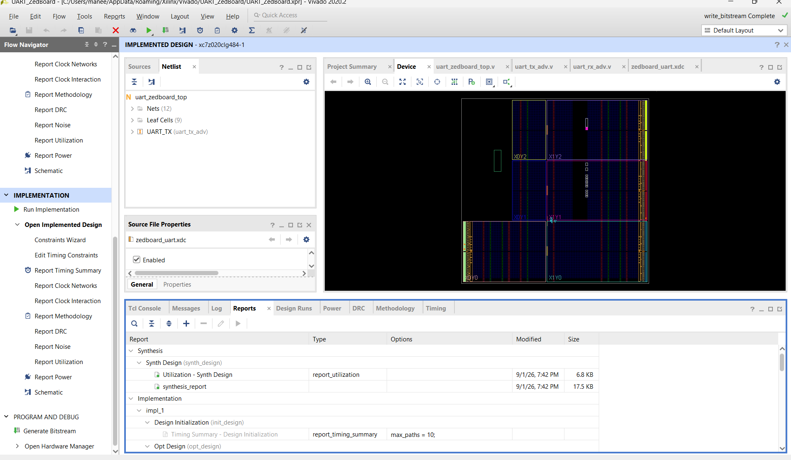

# Advanced UART Controller using Verilog HDL


## Project Overview

This project presents the design, simulation, synthesis, implementation, and bitstream generation of an Advanced UART (Universal Asynchronous Receiver Transmitter) Controller using Verilog HDL.

The UART controller supports serial data transmission and reception with configurable baud rate, optional parity handling, parity error detection, frame error detection, and RX data validation.

The design was developed using modular RTL design methodology and targeted for FPGA implementation on the ZedBoard platform.

---

## Project Objectives

The main objectives of this project are:

- To design a UART transmitter using Verilog HDL.
- To design a UART receiver using Verilog HDL.
- To implement configurable baud-rate operation.
- To implement optional parity generation and checking.
- To detect parity errors.
- To detect frame errors.
- To verify UART communication using behavioral simulation.
- To synthesize and implement the RTL design for FPGA.
- To generate an FPGA programming bitstream.

---

## System Architecture

The overall UART architecture consists of two major blocks:

```text
                         ADVANCED UART CONTROLLER
                                  |
             +--------------------+--------------------+
             |                                         |
             v                                         v
     +---------------+                         +---------------+
     | UART          |                         | UART          |
     | TRANSMITTER   |                         | RECEIVER      |
     |    (TX)       |                         |    (RX)       |
     +-------+-------+                         +-------+-------+
             |                                         ^
             |                                         |
             |       Serial UART Communication         |
             +---------------> TXD/RXD <---------------+
             |
             v
       Serial Data
```

### Transmitter

The UART transmitter converts 8-bit parallel data into serial UART data.

```text
Parallel Data
     |
     v
+------------------+
| TX Data Register |
+------------------+
     |
     v
+------------------+
| Baud Rate        |
| Generator        |
+------------------+
     |
     v
+------------------+
| TX Control FSM   |
+------------------+
     |
     v
+------------------+
| Serial TX Output |
+------------------+
```

### Receiver

The UART receiver converts the incoming serial UART data back into 8-bit parallel data.

```text
Serial RX Input
      |
      v
+------------------+
| Start Bit        |
| Detection        |
+------------------+
      |
      v
+------------------+
| RX Control FSM   |
+------------------+
      |
      v
+------------------+
| Serial-to-       |
| Parallel         |
+------------------+
      |
      v
+------------------+
| Parity / Frame   |
| Error Detection  |
+------------------+
      |
      v
Received Data
```

---

## UART Frame Format

The UART communication frame used in this project consists of:

```text
       START       DATA[7:0]       PARITY       STOP
        1 bit        8 bits        0/1 bit      1 bit

         0          LSB First      Optional       1
       +----+----------------------+---------+------+
       | 0  | D0 D1 D2 D3 D4 D5 D6 D7 |  P   |  1   |
       +----+----------------------+---------+------+
```

### Frame Fields

| Field | Size | Description |
|---|---:|---|
| Start Bit | 1 bit | Indicates the beginning of UART transmission |
| Data | 8 bits | Actual transmitted data, LSB first |
| Parity | 0/1 bit | Optional error detection bit |
| Stop Bit | 1 bit | Indicates the end of transmission |

---

## Key Features

- 8-bit UART communication
- Configurable baud rate
- UART transmitter
- UART receiver
- Optional parity support
- Even parity support
- Odd parity support
- Parity error detection
- Frame error detection
- RX data validation
- TX busy indication
- Modular Verilog RTL design
- Behavioral simulation
- FPGA synthesis
- FPGA implementation
- Bitstream generation

---

## Design Parameters

| Parameter | Value |
|---|---|
| Data Width | 8 bits |
| Default Baud Rate | 9600 |
| Start Bit | 1 bit |
| Stop Bit | 1 bit |
| Parity | Configurable |
| Parity Modes | None / Even / Odd |
| HDL | Verilog |
| FPGA Board | ZedBoard |
| FPGA Family | Zynq-7000 |
| Communication Protocol | UART |

---

## Project Directory Structure

```text
Advanced-UART-ZedBoard-Verilog/
│
├── src/
│   ├── uart_tx_adv.v
│   ├── uart_rx_adv.v
│   └── uart_zedboard_top.v
│
├── testbench/
│   ├── uart_tb_adv.v
│   └── uart_tb1_adv.v
│
├── constraints/
│   └── uart_zedboard.xdc
│
├── bitstream/
│   └── uart_zedboard_top.bit
│
├── results/
│   ├── simulation_waveform.png
│   ├── synthesis_success.png
│   ├── implementation_success.png
│   └── bitstream_success.png
│
├── README.md
└── LICENSE
```

---

## RTL Modules

### 1. UART Transmitter

**File:**

```text
src/uart_tx_adv.v
```

The transmitter is responsible for:

- Accepting 8-bit parallel input data.
- Generating the UART start bit.
- Transmitting 8 data bits serially.
- Generating the optional parity bit.
- Generating the stop bit.
- Providing a TX busy indication.

### 2. UART Receiver

**File:**

```text
src/uart_rx_adv.v
```

The receiver is responsible for:

- Detecting the UART start bit.
- Sampling incoming serial data.
- Reconstructing the 8-bit received data.
- Checking the optional parity bit.
- Detecting invalid stop bits.
- Generating parity and frame error flags.
- Generating an RX data valid signal.

### 3. ZedBoard Top Module

**File:**

```text
src/uart_zedboard_top.v
```

The top module connects the UART controller with the FPGA-level inputs and outputs using the ZedBoard pin constraints.

---

## Verification

The UART controller was verified using Verilog behavioral simulation.

Two testbenches were used:

### Normal UART Testbench

**File:**

```text
testbench/uart_tb_adv.v
```

This testbench verifies normal UART transmission and reception.

### Error Detection Testbench

**File:**

```text
testbench/uart_tb1_adv.v
```

This testbench is used to verify UART error detection functionality.

---

## Simulation Test Cases

| Test Case | Description | Result |
|---|---|---|
| Test 1 | Transmission and reception of `8'hAA` | PASS |
| Test 2 | Transmission and reception of `8'h55` | PASS |
| Test 3 | Intentional parity error | PASS |
| Test 4 | Frame error test | Tested |

### Test 1 — Normal UART Communication

Transmitted data:

```text
8'hAA
```

Received data:

```text
8'hAA
```

Result:

```text
RX VALID = 1
PARITY ERROR = 0
FRAME ERROR = 0
```

### Test 2 — Normal UART Communication

Transmitted data:

```text
8'h55
```

Received data:

```text
8'h55
```

Result:

```text
RX VALID = 1
PARITY ERROR = 0
FRAME ERROR = 0
```

### Test 3 — Parity Error Detection

An intentional parity error was introduced during the test.

Result:

```text
RX VALID = 0
PARITY ERROR = 1
FRAME ERROR = 0
```

This confirms that the receiver can detect an incorrect parity bit.

### Test 4 — Frame Error Detection

A frame error condition was tested by modifying the stop-bit condition during simulation.

The frame-error detection logic is included in the receiver design.

---

## Simulation Waveform

The UART design was verified using behavioral simulation.

The waveform demonstrates:

- Clock operation
- UART transmission
- UART reception
- Start bit
- Data bits
- Parity handling
- Stop bit
- RX data validation
- Error detection



---

## FPGA Synthesis

The RTL design was synthesized using Xilinx Vivado for the ZedBoard FPGA target.



The synthesis process completed successfully.

---

## FPGA Implementation

After synthesis, the design was successfully implemented.

Implementation includes:

- Placement
- Routing
- Timing analysis
- FPGA resource mapping


---

## Bitstream Generation

After successful synthesis and implementation, the FPGA programming bitstream was generated.



The generated bitstream is available at:

```text
bitstream/uart_zedboard_top.bit
```

---

## Resource Utilization

The synthesized UART design uses a very small portion of the available FPGA resources.

| Resource | Used | Available | Utilization |
|---|---:|---:|---:|
| Slice LUTs | 18 | 53,200 | 0.034% |
| Slice Registers | 25 | 106,400 | 0.024% |
| Bonded IOBs | 3 | 200 | 1.50% |
| BUFGCTRL | 1 | 32 | 3.13% |

The low resource utilization indicates that the UART controller has a lightweight RTL implementation and can be integrated into larger FPGA-based systems.

---

## Tools and Technologies

### Hardware

- ZedBoard
- Zynq-7000 FPGA

### HDL

- Verilog HDL

### FPGA Design Tool

- Xilinx Vivado

### Design Methodology

- RTL Design
- Behavioral Simulation
- Synthesis
- Implementation
- Bitstream Generation

---

## Applications

UART controllers are widely used in:

- FPGA-to-PC communication
- Embedded systems
- Microcontroller communication
- Serial data transfer
- Hardware debugging
- System monitoring
- FPGA peripheral interfaces
- Embedded communication systems

---

## Advantages

- Simple and reliable serial communication
- Low hardware complexity
- Modular RTL architecture
- Configurable communication parameters
- Built-in error detection
- Suitable for FPGA-based systems
- Easy integration with larger digital systems

---

## Future Enhancements

The following features can be added in future versions:

- FIFO-based UART buffering
- Higher baud-rate support
- Configurable data width
- AXI interface integration
- Interrupt-based UART communication
- Hardware validation using a physical ZedBoard
- Integration with a processor-based embedded system
- DMA-based high-speed serial communication

---

## Project Highlights

- Designed a complete UART TX/RX controller using Verilog HDL.
- Implemented configurable baud-rate operation.
- Implemented optional parity generation and checking.
- Implemented parity error detection.
- Implemented frame error detection.
- Created dedicated simulation testbenches.
- Verified normal UART communication.
- Verified intentional parity error detection.
- Successfully synthesized the RTL design.
- Successfully implemented the design for FPGA.
- Generated the FPGA bitstream.
- Organized all RTL, testbench, constraints, results, and bitstream files in a structured GitHub repository.

---

## Author

**Maneesha Putluru**

Electronics and Communication Engineering

---

## License

This project is licensed under the MIT License.

See the [LICENSE](LICENSE) file for details.
